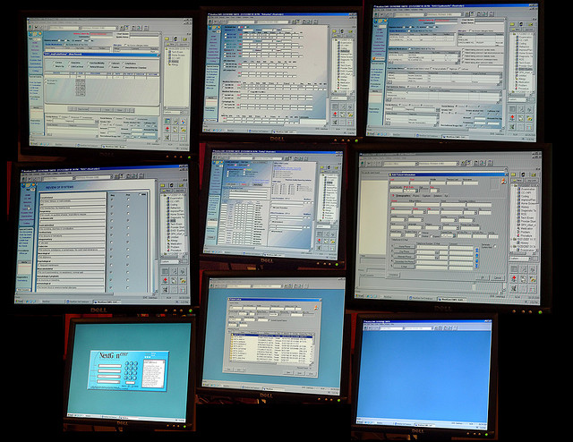

% title: Testing Beyond jUnit
% subtitle: (a Madison-Milwaukee CodeChix Talk)
% author: Mindy Preston
% thankyou: Thanks everyone!
% thankyou_details: And especially these people:
% contact: CodeChix Madison <a href="http://www.codechix/">website</a>

---
title: Testing Beyond jUnit
build_lists: false

<!-- preliminaries:

* can everyone hear me?
* if I'm talking too fast/slow, loud/soft, please raise your hand and let me know
* same if you need me to repeat something or if you want to request clarification
* language/platform agnostic
* I have a list of resources at a URL that I'll share at the end of the presentation, including links to specific frameworks and testing packages for various stacks
* please save substantive questions/comments for the end; there will be time to discuss them
-->
What we'll talk about

- what I mean by 'testing'
- why test?
- testing methodologies
- what to do with testing data
- your questions!

---
title: You Keep Using That Word

<!-- explain what I mean when I say "testing" -->

- figure out whether your software does what it should (at arbitrary granularity)
- "what it should" is often the hard part of testing
- focus on automated testing but manual testing has its place
- more philosophically: testing is a way to cope with an imperfect world

---
class: img-top-center
<!-- things testing encompasses: happy path (the code does the right thing to well-formed input in the absence of exceptions) -->

<footer class="source">Flickr user foilman, unaltered, CC-BY-SA 2.0</footer>

---
class: img-top-center

<!-- the program handles bad input as specified (hopefully gracefully) -->
<!-- small number of correct inputs, huge array of bad inputs -->

<footer class="source">Flickr user orijinal, unaltered, CC-BY 2.0</footer>

---
class: img-top-center

<!-- the program handles systems failures as gracefully as possible -->
<!-- e.g., internet not available -->

<footer class="source">Flickr user grantwickes, unaltered, CC-BY 2.0</footer>
---
most people focus on 

but the worst bugs are usually
 and 

---
title: why test?

<!-- if you're not doing it, your users (or your QA people, or your support people, or people who build things on top of your product) are doing it for you '-->
* if not you, who?

---
title: User-Generated Bug Reports
<!-- users make terrible bug reports. -->

<pre class="prettyprint" data-lang="plaintext">
To: bug-reports@strexcorp.com
Subject: submit doesn't work

When I click "submit" on the form my screen goes dark and I get an error message??????
</pre>

---
title: Patience is a Finite Resource

<!-- user patience is a finite resource.  if your product is generally reliable you'll start up top, but every user-visible bug you ship moves you closer to the bottom of this list. ' -->

* "better report this bug!"
* "surely it's meant to work this way; we must be doing it wrong" <!-- which is great until you fix it -->
* "I'll just live with it" <!-- e.g. when I run report X I get the wrong value in column Y; I'll just ignore column Y -->
* "we'll fix it ourselves" <!-- not always, but possible for some platforms; this REALLY burns goodwill -->
* "this thing sucks; let's get/build something else"

---

* you can't catch every bug with testing. <!-- ' -->
* that makes it *even more important* to catch the bugs you can catch.
* you don't want to burn your user (QA, support, developer, etc) patience on things you could've caught yourself

<!-- why test section was ~3 minutes -->

---
title: How to Test

* unit tests 
	* test-driven development
	* generative tests
* integration tests
* performance tests
* regression tests
* user experience tests
* a shoutout to manual testing

---
title: Unit tests
<!-- generally, take the form of some kind of assertion about your data - usually the return value from a function -->

<!-- it can be hard to see the point of these small tests when we're writing them.  When we've really got our heads in the code that we're testing, it seems obvious that the code either works or it doesn't; or maybe we know how to test it manually, so it seems silly to automate this testing.  -->
<!-- It's true that we usually know a function's behavior when we're writing the function, and for a little while after we're done, but it doesn't stay obvious.  And if it's someone else's code, *even if it's well-written*, it's usually not at all obvious. -->

<!-- for example, we need to refactor myCoolFunction -->

<pre class="prettyprint" data-lang="java">
function testMyCoolFunction() {
	assert myCoolFunction(goodData) == expectedValue;
	assert myCoolFunction(badData) == expectedErrorValue;
	breakSomethingImportant();
	assert myCoolFunction(goodData) == expectedException;
}
</pre>
---
title: Test-Driven Development

Test-Driven Development (TDD) - an excellent way to make sure that

* you actually write tests for your code
* your code actually passed the tests, at least at one point

---
title: Bad Data 

Happy families are all alike; every unhappy family is unhappy in its own way.

-- Leo Tolstoy, <i>Anna Karenina</i>

<!-- so too with good data and bad data.  There's probably >1 kind of data that your function shouldn't try to operate on. -->

<!-- example: a string-to-object parser that expects json -->

<pre class="prettyprint" data-lang="java">
function testMyCoolFunction() {
	assert myCoolFunction(nullData) == expectedErrorValue;
	assert myCoolFunction(dataMissingAParticularField) == expectedErrorValue;
	assert myCoolFunction(justPlainWeirdData) == expectedErrorValue;
	assert myCoolFunction(maliciouslyIncorrectData) == expectedErrorValue;
	assert myCoolFunction(incompleteData) == expectedErrorValue;
	assert myCoolFunction((╯°□°）╯︵ ┻━┻) == expectedErrorValue;
	...
}
</pre>
---
title: Generative Testing
<!-- generally our unit tests take the form of some assertion about returned values from functions -->
<!-- what if we could make assertions about our *code* instead? -->
* our functions have *properties* (e.g., "always returns a JSON object or throws a BadDataException")
* we use *generators* to generate a bunch of random data with which to test them 
<!-- about 15 minutes -->
---
title: JavaScript example using Gentest
<pre class="prettyprint" data-lang="javascript">
forAll([gentest.types.int,         // type of base
        gentest.types.int],        // type of exponent

       'custom pow implementation equivalent to builtin',   // name of property

       function(base, exponent) {  // function to verify the property
         return Math.pow(base, exponent) === pow(base, exponent);
       });
</pre>

<footer class="source">example adapted from http://toxicsli.me/gentest-slides/ (Scott Feeney, gentest framework author)</footer>
---

<!-- You can then ask for a certain number of randomized tests to be run.  -->

If any randomly generated data falsified the proposition, the test framework will
* attempt to figure out the smallest set of data that generates a failing test
* report the test failure, along with the specific data set that caused it

<!-- note the advantage of getting tests for cases you didn't think of -->
<!-- turning failed generative tests into unit tests -->

---
title: Unit tests
<!-- having lots of bad cases isn't the only way your tests can get complicated -->
<!-- in more complicated cases, you have to do a lot of bookkeeping; moreover, statechecking can get nontrivial -->
<!-- you can see this when unit tests are the only testing framework; in a lot of cases, other kinds of testing frameworks are better for nontrivial side-effecting systems -->

<pre class="prettyprint" data-lang="c">
void testMySideEffectingFunction() {
	state = establishInitialState();
	ASSERT_EQUAL(mySideEffectingFunction(state, goodData), expectedValue);
	ASSERT_EQUAL(state, expectedModifiedState);
	destroyState(state);
}
</pre>

---
title: integration tests

<footer class="source">Flickr user wetsun, unaltered, CC-BY-SA 2.0</footer>

<!-- making sure your individual units fit together.  Interfaces between modules and systems are where bugs spawn -->
<!-- usually require some infrastructure and more time to run than unit tests -->
<!-- also usually more complicated to write, especially when targeting specific things; important to prioritize and make tests for what's essential first (it builds! it runs!) -->

---
title: Continuous Integration

<!-- integration tests work best when they're run very frequently.  common schedules are daily, bidaily (before and after workday), or hourly. -->
<!-- continuous integration, which is kicked off as a result of a code commit, is gaining ground as tooling supports it -->
<!-- there are loads of frameworks for building larger tests in many languages, but many people write their own -->

* run integration tests whenever someone commits a code change
---
title: Travis CI

<!-- nice example: capomastro builds. https://travis-ci.org/capomastro/capomastro -->

---
title: What About Systems Failures?

* Netflix Simian Army

---
title: performance tests
class: img-top-center

<!-- it's important to think about because the right answer, too late to help me, is as bad as no answer -->
<!-- consider the whole application - your webapp's JS can be fast, but that doesn't help if it's rendering the results of an extremely slow database query -->
<!-- implementing performance tests is highly dependent on your stack and your application; many people end up having to write their own framework -->
<!-- sometimes integration testing frameworks can help you here; many will give stats on time to build & time to run tests, which may or may not map to real-world performance for you -->

---
title: Regression Tests

* hm, that used to work...
<!-- making sure old bugs don't creep back into your code -->
<!-- can be from problems with code hygiene (e.g. old code being merged back in) or brittle patterns (everyone who touches this function forgets that something else it calls can return NULL) -->
<!-- generally, a separate set of tests that gets run on fairly far-along release candidates -->
<!-- if it's possible, it's good to run these as part of your continuous integration -->

---
title: User Experience Tests

<footer class="source">Flickr user juhansonin, unaltered, CC-BY 2.0</footer>
<!-- bad UX is a bug -->
<!-- a lot of people don't do UX testing because they assume it's hard or expensive -->
<!-- this is another thing where you can improve a lot by just putting in a little bit of effort -->
<!-- pay someone a token amount to use your app while you film them -->

---
title: UX testing with paper mockups

* make paper printouts of the screens a userwould advance through
* have a human switch the paper printouts in response to what the user tries

<!-- you can figure out how a user thinks about your app -->
<!-- you can also figure out pretty quickly what you didn't think about -- 'I don't have a paper for that!' is a bug -->

---
title: A/B testing

* test a hypothesis about your site (e.g. removing required signup will result in more finished checkouts) by giving some users an experimental version and some users your existing version

---
title: Manual Tests

* your QA team are your <strike>crime</strike>bugfighting partners!
* bugs that your QA team finds *repeatedly* are prime candidates for test automation
* automate the boring parts of testing so your QA team can get user-quality bugs

<!-- that's it for methodologies; now we're going to talk about dealing with test data -->
---
title: Dealing with Test Data

<!-- doing a lot of testing isn't helpful unless you're using the results of your tests to make better software.  if your test stack is unmanageable, people will stop paying attention to it and your quality will suffer. -->

---
title: Tracking and Delivery

<!-- delivering results from tests is a big deal; they're often too cumbersome for a developer to run locally (or require coordination if multiple components are being developed in parallel).  frameworks that get this right are key. -->

* email is hard to search and correlate
* too many emails -> email isn't read

---
title: Slicing, dicing, and recombinating

* Logstash demo

<!-- graphite/jenkins seems to be a common pair -->

<!-- logstash for log stashin' gets some love too ; with aggregated logs across multiple builds you can ask questions like "how many tests failed on a null pointer exception in this class" to make a case for refactoring, for example -->

<!-- quick demo if possible - 
https://logstash.openstack.org , search for build_status:"FAILURE", show breakdown of build_queue, re-search for build_queue="gate", drill down into errors -->

---

Questions?

---
title: More Information

Resources: https://bit.ly/1ASqBPb OR http://www.github.com/yomimono/talks/blob/master/testing_codechix/resources.md

Slides: https://github.com/yomimono/talks/blob/master/testing_codechix/slides/slides.md

Contact me: @mindypreston on Twitter or mindy@somerandomidiot.com

Image links:
* misaligned lock: https://flic.kr/p/5JXY8
* happy path: https://flic.kr/p/9xsRGz
* sign error: https://flic.kr/p/fp1VYU
* outage: https://flic.kr/p/c9tWfo
* loading screen: https://flic.kr/p/3GDk3
* bad UX: https://flic.kr/p/6SUtcs
