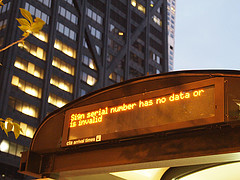

% title: Testing Beyond jUnit
% subtitle: (a Madison-Milwaukee CodeChix Talk)
% author: Mindy Preston
% thankyou: Thanks everyone!
% thankyou_details: And especially these people:
% contact: CodeChix Madison <a href="http://www.codechix/">website</a>

<!-- preliminaries:

* can everyone hear me?
* if I'm talking too fast/slow, loud/soft, please raise your hand and let me know
* same if you need me to repeat something or if you want to request clarification
* please save substantive questions/comments for the end; there will be time to discuss them

---
title: Testing Beyond jUnit
build_lists: false

What we'll talk about

- what I mean by 'testing'
- why test?
- testing methodologies
- what to do with testing data
- your questions!

---
title: You Keep Using That Word

<!-- explain what I mean when I say "testing" -->

- figure out whether your software does what it should
- "what it should" is often the hard part of testing
- focus on automated testing but manual testing has its place

---
<!-- things testing encompasses: happy path (the code does the right thing to well-formed input in the absence of exceptions) -->

<!--TODO image -->

<footer class="source">Flickr user foilman, unaltered, CC-BY-SA 2.0</footer>

---
<!-- the program handles bad input as specified (hopefully gracefully) -->
<!--TODO image -->

<footer class="source">Flickr user orijinal, unaltered, CC-BY 2.0</footer>

---
<!-- the program handles systems failures as gracefully as possible -->
<!-- TODO image -->

<footer class="source">Flickr user grantwickes, unaltered, CC-BY 2.0</footer>
---
most people focus on 

but the worst bugs are usually
 and 
---

<!-- about 5 mins from start of talk to this point -->

---
title: why test?

<!-- if you're not doing it, your users (or your QA people, or your support people, or people who build things on top of your product) are doing it for you '-->
<!-- TODO graph of software bugs; nice visual on how there's no bug-free software -->
if not you, who?

---
title: User-Generated Bug Reports
<!-- users make terrible bug reports. -->

<!--TODO: get a really horrible email screenshot of the "it's broken" sort -->
---
title: Patience is a Finite Resource

<!-- user patience is a finite resource.  if your product is generally reliable you'll start up top, but every user-visible bug you ship moves you closer to the bottom of this list. ' -->

* "surely it's meant to work this way; we must be doing it wrong"
* "I'll just live with it"
* "this thing sucks; let's get/build something else"

---

you can't catch every bug with testing. <!-- ' -->

---

that makes it *even more important* to catch the bugs you can catch.

<!-- why test section was ~3 minutes -->

---
title: How to Test

* unit tests 
	* test-driven development
	* generative tests
* integration tests
* performance tests
* regression tests
* a shoutout to manual testing
* user experience tests

---
title: Unit tests
<!-- generally, take the form of some kind of assertion about your data - usually the return value from a function -->

<!-- it can be hard to see the point of these in systems that are put together like we're taught they should be -- small functions limited in scope doing one job -- because those functions are human-sized and we imagine we know their behavior.  It's true that we know their behavior when we're writing the function, and for a little while after we're done, but as anyone who's had to go back and read their code years later  can tell you, it doesn't stay obvious. -->

<!-- refactoring and legacy code shoutout. -->

<!-- TODO: redo this in javascript -->
<pre class="prettyprint" data-lang="java">
function testMyCoolFunction() {
	assert myCoolFunction(goodData) == expectedValue;
	assert myCoolFunction(badData) == expectedErrorValue;
	breakSomethingImportant();
	assert myCoolFunction(goodData) == expectedException;
}
</pre>
---
title: Test-Driven Development

Test-Driven Development (TDD) - an excellent way to make sure that

* you actually write tests for your code
* your code actually passed the tests, at least at one point

---
title: Unit tests
<!-- in more complicated cases, you have to do a lot of bookkeeping; moreover, statechecking can get nontrivial -->
<!-- you can see this when unit tests are the only testing framework; in a lot of cases, other kinds of testing frameworks are better for nontrivial side-effecting systems -->

<!-- TODO: look up some of those -->

<pre class="prettyprint" data-lang="c">
void testMySideEffectingFunction() {
	state = establishInitialState();
	ASSERT_EQUAL(mySideEffectingFunction(state, goodData), expectedValue);
	ASSERT_EQUAL(state, expectedModifiedState);
	destroyState(state);
}
</pre>

---
title: Bad Data 

Happy families are all alike; every unhappy family is unhappy in its own way.

-- Leo Tolstoy, <i>Anna Karenina</i>

<!-- so too with good data and bad data.  There's probably >1 kind of data that your function shouldn't try to operate on. -->

<pre class="prettyprint" data-lang="java">
function testMyCoolFunction() {
	assert myCoolFunction(nullData) == expectedErrorValue;
	assert myCoolFunction(dataMissingAParticularField) == expectedErrorValue;
	assert myCoolFunction(justPlainWeirdData) == expectedErrorValue;
	assert myCoolFunction(maliciouslyIncorrectData) == expectedErrorValue;
	assert myCoolFunction(incompleteData) == expectedErrorValue;
	assert myCoolFunction((╯°□°）╯︵ ┻━┻) == expectedErrorValue;
	...
}
</pre>
---
title: Generative Testing
<!-- generally our unit tests take the form of some assertion about returned values from functions -->
<!-- what if we could make assertions about our *code* instead? -->
* our functions have *properties* (e.g., "always returns a JSON object or throws a BadDataException")
* we use *generators* to generate a bunch of random data with which to test them 
<!-- about 8 minutes from methodology to here -->
---
title: JavaScript example using Gentest
<pre class="prettyprint" data-lang="javascript">

forAll([gentest.types.int,         // type of base
        gentest.types.int],        // type of exponent

       'custom pow implementation equivalent to builtin',   // name of property

       function(base, exponent) {  // function to verify the property
         return Math.pow(base, exponent) === pow(base, exponent);
       });
</pre>

<footer class="source">example adapted from http://toxicsli.me/gentest-slides/ (Scott Feeney, gentest framework author)</footer>
---

<!-- You can then ask for a certain number of randomized tests to be run.  -->

If any randomly generated data falsified the proposition, the test framework will
* attempt to figure out the smallest set of data that generates a failing test
* report the test failure, along with the specific data set that caused it

<!-- note the advantage of getting tests for cases you didn't think of -->

---
title: integration tests

<footer class="source">Flickr user wetsun, unaltered, CC-BY-SA 2.0</footer>

<!-- making sure your individual units fit together.  Interfaces between modules and systems are where bugs spawn -->
<!-- usually require some infrastructure and more time to run than unit tests -->
<!-- also usually more complicated to write, especially when targeting specific things; important to prioritize and make tests for what's essential first (it builds! it runs!) -->

---
title: Continuous Integration

<!-- integration tests work best when they're run very frequently.  common schedules are daily, bidaily (before and after workday), or hourly. -->
<!-- continuous integration, which is kicked off as a result of a code commit, is gaining ground as tooling supports it -->

* run integration tests whenever someone commits a code change

---

---
title: Tracking and Delivery

<!-- delivering results from integration tests is a big deal; they're often too cumbersome for a developer to run locally (or require coordination if multiple components are being developed in parallel).  frameworks that get this right are key. -->

<!-- Jenkins, Travis; who else? -->
---
title: Travis CI

<!-- TODO need a LOT more content here -->
---
title: performance tests

<!-- it's important to think about because the right answer, too late to help me, is as bad as no answer -->
<!-- consider the whole application - your webapp's JS can be fast, but that doesn't help if it's rendering the results of an extremely slow database query -->
<!-- implementing performance tests is highly dependent on your stack and your application; many people end up having to write their own framework -->
<!-- sometimes integration testing frameworks can help you here; many will give stats on time to build & time to run tests, which may or may not map to real-world performance for you -->
<!-- shoutout to statsd/graphite for performance monitoring -->
---
title: Analyzing Integration Test Data

<!-- graphite/jenkins seems to be a common pair -->

<!-- logstash for log stashin' gets some love too ; with aggregated logs across multiple builds you can ask questions like "how many tests failed on a null pointer exception in this class" to make a case for refactoring, for example -->

<!-- quick demo if possible - 
https://logstash.openstack.org , search for build_status:"FAILURE", show breakdown of build_queue, re-search for build_queue="gate", drill down into errors -->

---
title: Slide with a figure
subtitle: Subtitles are cool too
class: img-top-center

- Some point to make about about this figure from wikipedia
- This slide has a class that was defined in theme/css/custom.css

<footer class="source"> Always cite your sources! </footer>

---
title: Segue slide
subtitle: I can haz subtitlz?
class: segue dark nobackground

---
title: Maybe some code?

press 'h' to highlight an important section (that is highlighted
with &lt;b&gt;...&lt;/b&gt; tags)

<pre class="prettyprint" data-lang="javascript">
function isSmall() {
  return window.matchMedia("(min-device-width: ???)").matches;
}

<b>function hasTouch() {
  return Modernizr.touch;
}</b>

function detectFormFactor() {
  var device = DESKTOP;
  if (hasTouch()) {
    device = isSmall() ? PHONE : TABLET;
  }
  return device;
}
</pre>

